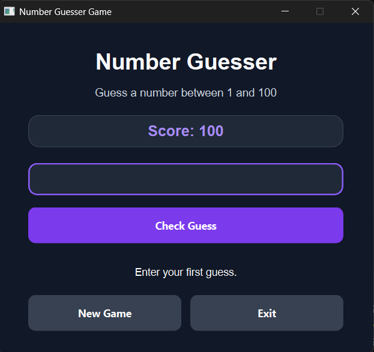
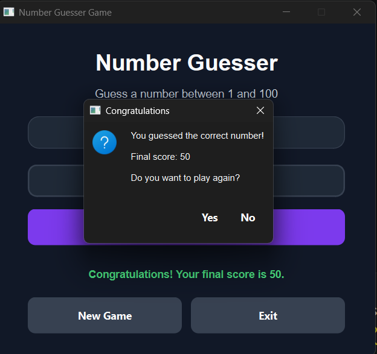

<div align="center">

# 🎯 Number Guesser Game

A modern number guessing game built with **Python** and **PySide6**.

Guess the hidden number, follow the hints, and try to finish the game with the highest possible score!

<br>


</div>

---

## 🎮 Game Preview

<p align="center">
  
</p>

<p align="center">
  <em>Main window of the Number Guesser Game</em>
</p>

---

## 📖 About the Project

**Number Guesser Game** is a simple desktop game in which the program generates a random number between `1` and `100`.

The player enters a guess, and the game provides a hint indicating whether the hidden number is higher or lower.

The player starts with a score of `100`. Each incorrect guess reduces the score by `10`, but the score never becomes negative.

This project was created to practice:

- Python programming
- Object-oriented programming
- Modular project structure
- Input validation
- Desktop GUI development
- Event-driven programming with PySide6

---

## ✨ Features

- Random number generation between `1` and `100`
- Higher and lower hints
- Score system
- Input validation
- Score protection from negative values
- New Game button
- Exit button
- Keyboard support with the Enter key
- Winning dialog
- Modern dark user interface
- Modular and maintainable project structure

---

## 🧮 Scoring System

The player starts each game with:

```text
Score: 100
```

Each incorrect guess decreases the score by:

```text
Penalty: 10
```

The score is calculated as follows:

```text
New Score = Current Score - Penalty
```

The minimum possible score is:

```text
0
```

Example:

| Incorrect Guesses | Final Score |
|------------------:|------------:|
| 0                 | 100         |
| 1                 | 90          |
| 2                 | 80          |
| 3                 | 70          |
| 5                 | 50          |
| 10 or more        | 0           |

---

## 📸 Screenshots

### Main Window

<p align="center">
  
</p>

### Correct Guess Dialog

<p align="center">
  
</p>

---

## 🗂️ Project Structure

```text
Number-Guesser-Game/
│
├── assets/
│   └── screenshots/
│       ├── main-window.png
│       └── winning-dialog.png
│
├── src/
│   ├── __init__.py
│   │
│   ├── game_logic/
│   │   ├── __init__.py
│   │   ├── hint_generator.py
│   │   ├── number_generator.py
│   │   └── scorer.py
│   │
│   ├── ui/
│   │   ├── __init__.py
│   │   └── main_window.py
│   │
│   └── utils/
│       ├── __init__.py
│       └── input_validator.py
│
├── main.py
├── requirements.txt
├── README.md
└── LICENSE
```

---

## 🧩 Project Modules

### `main.py`

The application entry point.

It creates the Qt application, displays the main window, and starts the GUI event loop.

### `main_window.py`

Handles the graphical user interface and user interactions, including:

- Reading the player's guess
- Displaying hints
- Updating the score
- Starting a new game
- Displaying the winning dialog
- Closing the application

### `number_generator.py`

Generates a random number within the selected range.

### `hint_generator.py`

Compares the player's guess with the hidden number and returns the appropriate hint.

### `scorer.py`

Manages the player's score, penalty, reset operation, and minimum score limit.

### `input_validator.py`

Validates the player's input and ensures that it is a valid integer between `1` and `100`.

---

## 🛠️ Technologies

- [Python](https://www.python.org/)
- [PySide6](https://doc.qt.io/qtforpython-6/)
- Qt Style Sheets
- Python Standard Library

---

## 📋 Requirements

Before running the project, make sure Python `3.10` or newer is installed.

Check your Python version:

```bash
python --version
```

The graphical interface requires:

```text
PySide6
```

---

## 🚀 Installation

### 1. Clone the repository

```bash
git clone https://github.com/YOUR_USERNAME/Number-Guesser-Game.git
```

### 2. Open the project directory

```bash
cd Number-Guesser-Game
```

### 3. Create a virtual environment

#### Windows

```bash
python -m venv .venv
```

Activate it:

```bash
.venv\Scripts\activate
```

#### Linux or macOS

```bash
python3 -m venv .venv
```

Activate it:

```bash
source .venv/bin/activate
```

### 4. Install the dependencies

```bash
pip install -r requirements.txt
```

### 5. Run the game

```bash
python main.py
```

---

## 📦 Requirements File

Create a file named `requirements.txt` in the project root and add:

```text
PySide6
```

To save the exact installed package versions, run:

```bash
pip freeze > requirements.txt
```

---

## 🎯 How to Play

1. Run the application.
2. Enter a number between `1` and `100`.
3. Click **Check Guess** or press the Enter key.
4. Read the hint displayed by the game.
5. Continue guessing until you find the hidden number.
6. Try to finish with the highest possible score.
7. Select **New Game** to generate another random number.

---

## 💡 Example

```text
Hidden number: 55
Player guess: 30

Hint:
Your guess is too low. Try a higher number.

Current score:
90
```

Another guess:

```text
Player guess: 70

Hint:
Your guess is too high. Try a lower number.

Current score:
80
```

Correct guess:

```text
Player guess: 55

Congratulations!
Your final score is 80.
```

---

## 🏗️ Architecture

The project follows a modular structure that separates the application into different responsibilities:

```text
User Interface
      │
      ▼
Input Validation
      │
      ▼
Game Logic
 ┌───────────────┐
 │ Number        │
 │ Hint          │
 │ Score         │
 └───────────────┘
```

This separation makes the project easier to:

- Read
- Test
- Maintain
- Debug
- Extend
- Reuse

---

## 🔮 Possible Future Improvements

- Difficulty levels
- Custom number ranges
- Limited number of attempts
- Best-score saving
- Player profiles
- Game history
- Sound effects
- Light and dark themes
- Animated feedback
- Timer mode
- Hint counter
- Multilingual interface
- Executable Windows version

---

## 🐛 Reporting Issues

To report a bug or suggest a new feature, open an issue in the GitHub repository.

Please include:

- A clear description of the issue
- Steps to reproduce it
- Expected behavior
- Actual behavior
- Screenshot or error message, when available

---

## 🤝 Contributing

Contributions are welcome.

To contribute:

1. Fork the repository.
2. Create a new branch.

```bash
git checkout -b feature/new-feature
```

3. Make your changes.
4. Commit your changes.

```bash
git commit -m "Add new feature"
```

5. Push the branch.

```bash
git push origin feature/new-feature
```

6. Open a Pull Request.

---

## 📄 License

This project is available under the [MIT License](LICENSE).

You are free to use, modify, and distribute this project according to the terms of the license.

---

## 👨‍💻 Author

Developed with Python and PySide6.

<p align="center">
  <a href="https://github.com/mr-amirasgari">
    
  </a>
</p>

---

<div align="center">

### ⭐ Give this repository a star if you found it useful!

Made with ❤️ and Python

</div>
