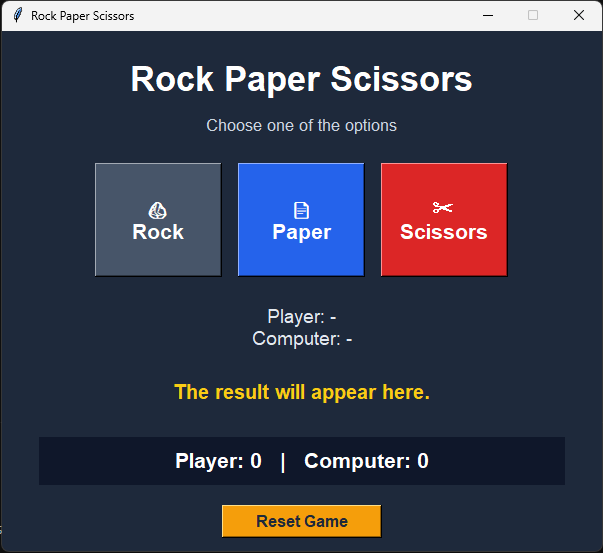

# Rock Paper Scissors GUI

A simple desktop Rock–Paper–Scissors game built with Python and Tkinter.

The player selects Rock, Paper, or Scissors, while the computer makes a random choice. The application determines the winner, displays the result, and keeps track of both scores.



## Features

- Graphical user interface built with Tkinter
- Random computer selection
- Player and computer score tracking
- Color-coded win, loss, and tie messages
- Reset button for restarting the game
- Object-oriented game logic
- No external dependencies

## Project Structure

```text
Rock_Paper_Scissors/
├── src/
│   ├── game.py
│   └── game.ipynb
├── screenshot.png
├── .gitignore
└── README.md
```

## Requirements

- Python 3
- Tkinter

Tkinter is included with most standard Python installations.

To verify that Tkinter is available:

```bash
python -m tkinter
```

## Run the Game

Clone the repository:

```bash
git clone https://github.com/mr-amirasgari/rock-paper-scissors-gui.git
cd rock-paper-scissors-gui
```

Run the application:

```bash
python src/game.py
```

On some systems:

```bash
python3 src/game.py
```

## How to Play

1. Start the application.
2. Select Rock, Paper, or Scissors.
3. The computer randomly selects an option.
4. The winner is determined using the standard rules:
   - Rock beats Scissors
   - Scissors beats Paper
   - Paper beats Rock
5. The scoreboard updates automatically.
6. Select **Reset Game** to reset both scores.

## Game Logic

The winning combinations are stored as tuples:

```python
winning_combinations = [
    ("rock", "scissors"),
    ("scissors", "paper"),
    ("paper", "rock"),
]
```

A round ends in a tie when both selections are equal. Otherwise, the selected pair is checked against the winning combinations.

## Technologies

- Python
- Tkinter
- `random` module
- Jupyter Notebook

## Possible Improvements

- Add keyboard controls
- Add sound effects and animations
- Add a best-of-three mode
- Save game history
- Add theme selection
- Package the application as an executable

## Author

Developed by **Amir Mohammad Asgari**

- GitHub: [mr-amirasgari](https://github.com/mr-amirasgari)