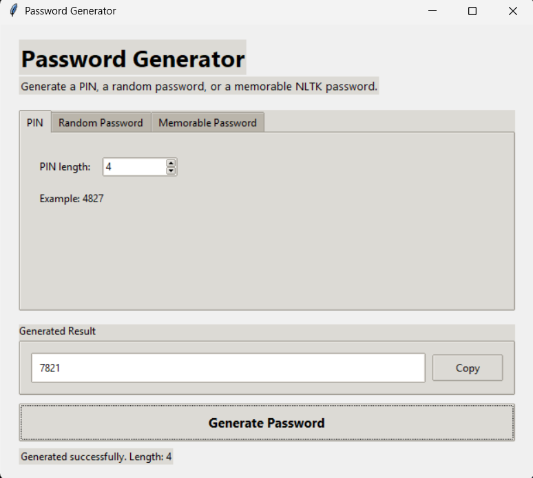
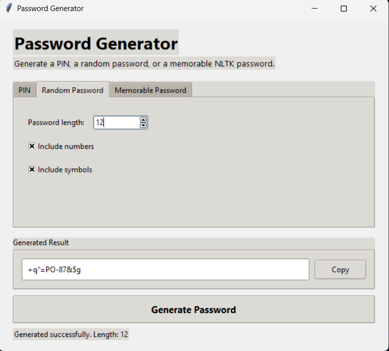
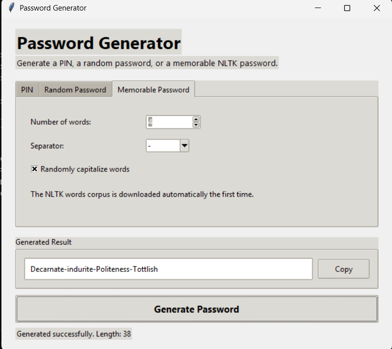

# Password Generator GUI

A desktop password generator built with Python, Tkinter, and NLTK.

The application provides three generation modes:

- Numeric PIN
- Random password
- Memorable word-based password

> **Educational note:** This project uses Python's `random` module because it was created as a programming exercise. It is not intended for generating passwords for sensitive or production accounts.

## Preview

### PIN Generator



### Random Password Generator



### Memorable Password Generator



## Features

- Generate numeric PINs with a custom length
- Generate random passwords with optional numbers and symbols
- Guarantee at least one number or symbol when the related option is enabled
- Generate memorable passwords using words from the NLTK corpus
- Choose the number of words and separator
- Randomly capitalize memorable-password words
- Copy generated results to the clipboard
- Display generation status and output length
- Validate invalid lengths and user input
- Download the NLTK words corpus automatically when required
- Object-oriented implementation with a shared abstract base class

## Generator Types

### PIN Generator

Creates a PIN containing only digits.

Example:

```text
7821
```

### Random Password Generator

Creates a password using letters and optional numbers and symbols.

Example:

```text
+q"=PO-87&$g
```

### Memorable Password Generator

Combines randomly selected NLTK words using a configurable separator.

Example:

```text
Decarnate-indurite-Politeness-Tottlish
```

## Project Structure

```text
password-generator/
├── assets/
│   └── screenshots/
│       ├── memorable-password.png
│       ├── pin-generator.png
│       └── random-password.png
├── src/
│   └── main.py
├── .gitignore
├── requirements.txt
└── README.md
```

## Technologies Used

- Python
- Tkinter
- ttk
- NLTK
- Python `abc` module
- Python `random` and `string` modules

## Requirements

- Python 3.10 or newer
- Tkinter
- NLTK

Tkinter is included with most standard Python installations.

## Installation

Clone the portfolio repository:

```bash
git clone https://github.com/mr-amirasgari/project-based-python-portfolio.git
cd project-based-python-portfolio/projects/03-password-generator
```

Install the external dependency:

```bash
python -m pip install -r requirements.txt
```

## Run the Application

```bash
python src/main.py
```

On some systems:

```bash
python3 src/main.py
```

The NLTK words corpus is downloaded automatically the first time the memorable-password generator is used.

It can also be downloaded manually:

```bash
python -m nltk.downloader words
```

## Design

All generators inherit from the abstract `PasswordGenerator` class and implement a common `generate()` method.

```python
class PasswordGenerator(ABC):
    @abstractmethod
    def generate(self) -> str:
        pass
```

Implemented generators:

- `PinGenerator`
- `RandomPasswordGenerator`
- `MemoryPasswordGenerator`

The `PasswordGeneratorApp` class manages the Tkinter interface and connects each tab to the related generator.

## Validation and Error Handling

The application checks for:

- Password and PIN lengths below one
- Password lengths too short for enabled options
- Empty or invalid NLTK vocabulary
- Invalid values entered in the interface
- Missing generated text before copying
- NLTK corpus download failures

Errors are displayed through Tkinter message boxes.

## Future Improvements

- Replace `random` with `secrets` for security-sensitive usage
- Add password-strength estimation
- Add a show/hide result option
- Add exclusion rules for ambiguous characters
- Add generation history
- Add automated tests
- Add dark and light themes
- Package the application as an executable

## Attribution

The original exercise idea is based on the Project-Based Python course by Pytopia.

The graphical interface, project structure, validation, documentation, and additional features represent my own learning work.

## Author

**Amir Mohammad Asgari**

- [GitHub Profile](https://github.com/mr-amirasgari)
