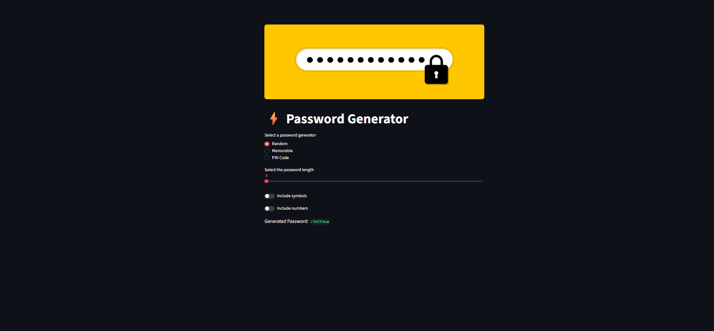

# Password Generator — Streamlit


A simple interactive password generator built with Python, Streamlit, object-oriented programming, and NLTK.

## Preview



## Features

- Generate random passwords
- Include numbers and symbols
- Generate memorable word-based passwords
- Customize separators and capitalization
- Generate numeric PIN codes
- Interactive Streamlit interface

## Project Structure

```text
04-password-generator-streamlit/
├── assets/
│   └── screenshots/
│       └── app-preview.png
├── src/
│   ├── images/
│   │   └── banner.jpeg
│   ├── app.py
│   └── password_generator.py
├── .gitignore
├── README.md
└── requirements.txt
```

## Installation

```bash
pip install -r requirements.txt
```

## Run the Application

```bash
python -m streamlit run src/app.py
```

## Technologies

- Python
- Streamlit
- NLTK
- Object-Oriented Programming

## Disclaimer

This project uses Python's `random` module and is intended for educational purposes. Do not use generated passwords for security-sensitive accounts.

## Author

**Amir Asgari**