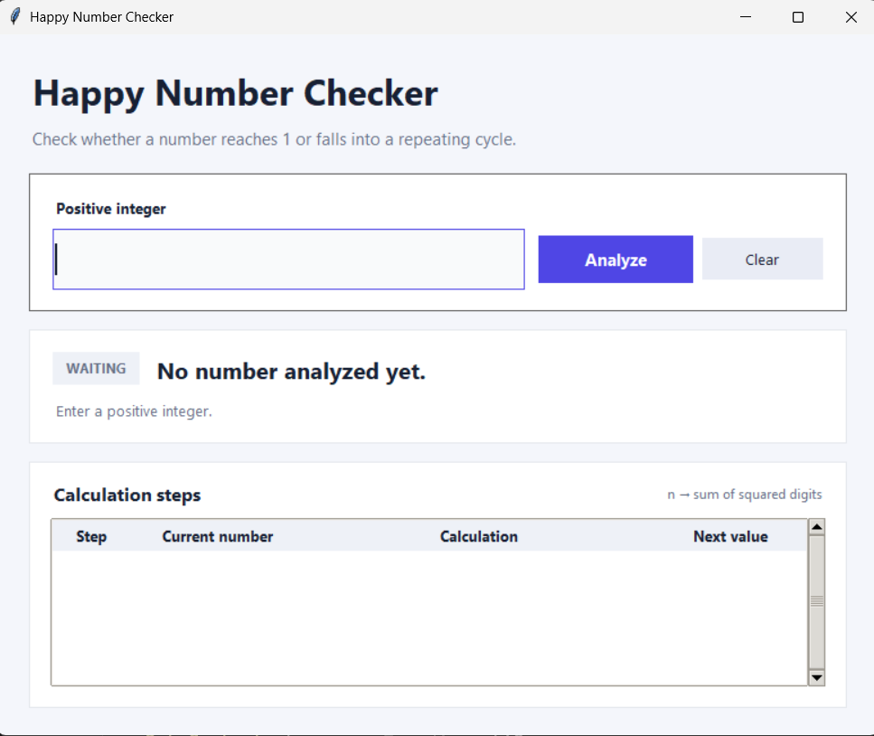

# Happy Number Checker


A desktop application for checking whether a positive integer is a happy number.

A number is happy when repeatedly replacing it with the sum of the squares of its digits eventually reaches `1`.

```text
19 → 82 → 68 → 100 → 1
```

## Preview



## Features

- Happy-number detection
- Repeating-cycle detection
- Full calculation steps
- Input validation
- Clear and reset controls
- Modern Tkinter interface
- Type hints and documented functions
- No third-party dependencies

## Project Structure

```text
Happy Number/
├── assets/
│   └── screenshots/
│       └── app-preview.png
├── src/
│   ├── core.py
│   └── gui.py
├── .gitignore
├── README.md
├── requirements.txt
└── run.py
```

## Requirements

- Python 3.10 or newer
- Tkinter

Tkinter is included with most Python installations on Windows.

## Run the Application

```bash
python run.py
```

## How It Works

The algorithm repeatedly calculates the sum of the squares of the current number's digits.

It stops when:

- The result reaches `1`, meaning the number is happy.
- A previously visited number appears again, meaning the sequence contains a cycle.

## Example

```text
Input: 19
19 → 82 → 68 → 100 → 1
Result: Happy Number
```

## Author

**Amir Asgari**
